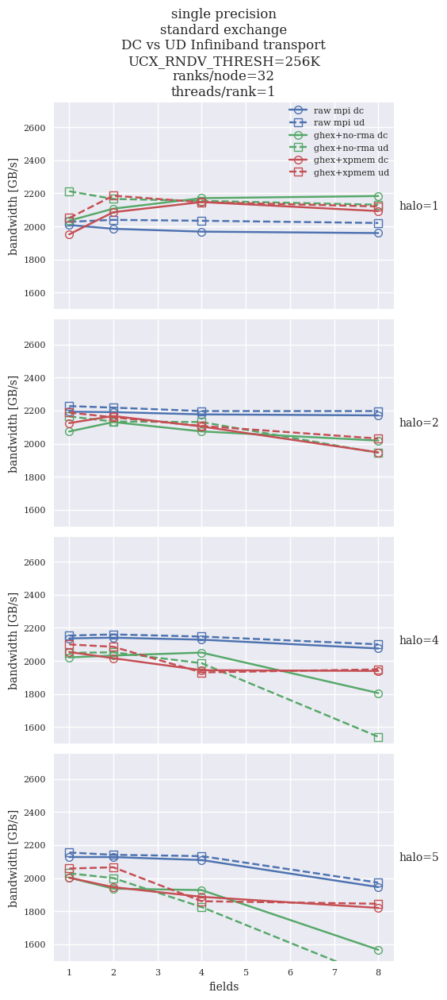
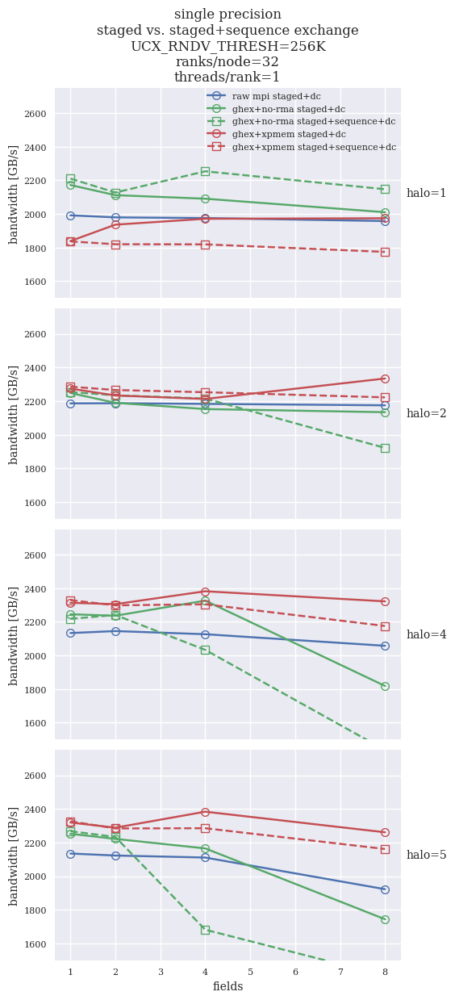

## 27-nodes results for `halfcores` configuration

27 nodes are the smallest number of compute nodes, for which the communication pattern is representative
of a large-scale computation. For single-node tests all data transfers are local, and hence the fabric
is not used. For less than 27 nodes, some nodes will effectively be both left- and right-side neighbor,
hence the communication pattern is different than for real-world applications. With 27 nodes, each node
has to effectively distribute the halos to 26 other compute nodes.

Below are results of weak-scaling runs with a 64^3 computational grid per-rank. Unless otherwise stated
we used a single precision `float`. `halfcores` configuration was used with 64 ranks per compute node, 
`hwcart` decomposition `--node 3 3 3 --socket 1 1 2 --numa 1 2 2 --l3 2 2 1 --core 2 1 1`.

Plots present cumulative effective memory bandwidth of the exchange operation (more=better).

* [Standard algorithm](#standard-algorithm)  
    * [Impact of `UCX_RNDV_THRS`](#impact-of-ucx_rndv_thresh)  
    * [Infiniband transport (DC vs UD)](#infiniband-transport-dc-vs-ud)  
    * [UCX vs MPI](#ucx-vs-mpi)  
    * [`impi` vs `ompi`](#impi-vs-ompi)  
* [Staged algorithm](#staged-algorithm)  
    * [Infiniband transport (DC vs UD)](#infiniband-transport-dc-vs-ud-1)  
    * [UCX vs MPI](#ucx-vs-mpi-1)  
    * [`impi` vs `ompi`](#impi-vs-ompi-1)  
* [Sequenced algorithm](#sequenced-algorithm)  
    * [Standard vs. sequenced](#standard-vs-sequenced)  
    * [Staged vs. sequenced+staged](#staged-vs-sequencedstaged)
* [`single` vs `double`](#single-vs-double)  
* [Fortran interface](#fortran-interface)  

### Standard algorithm

In the *standard algorithm* each rank performs explicit halo exchanges with each of the 26 neigobors. For
multiple fields the halo data is packed into a single array and sent in one large message.

The standard algorithm is implemented in all the `ghex` variants of the benchmark. 
The raw MPI version of the benchmark implements the [staged algorithm of the 3D halo exchange](#staged-algorithm).
As will be seen in the plots, the standard algorithm is in general inferior in performance to the
raw MPI implementation, but there are important exceptions.

#### Impact of `UCX_RNDV_THRESH`

The default value of `UCX_RNDV_THRESH` (the onset of large message transfer with zero-copy RMA) 
in UCX is 8KB for the send/recv methods used in GHEX. It turns out that the performace is in most cases 
better on this architecture when `UCX_RNDV_THRESH=256K` and
`UCX_ZCOPY_THRESH=256K`. The figure below shows the impact of running GHEX and the raw MPI codes with and without overriding 
`UCX_RNDV_THRESH` and `UCX_ZCOPY_THRESH` (always both values are set to 256K).
Notably, the largest impact is observed for halo 1, in which case this setting results in GHEX performing significantly
better than the raw MPI implementation. This is not the case for larger halos: in this case raw MPI implementation is
better.

#### Infiniband transport (DC vs UD)

Infiniband traffic can be sent using UD (unreliable datagram) and DC (connected) transports. Sometimes the performance
differs signifficantly. In the plots below we see that the raw MPI implementation performs similar. For the standard algorithm,
`ghex_comm+ucx` prefers the UD transport for small halos. In this case all variants give a simiar performance, comparable
to raw MPI implementation.

For larger halos the performance differs for `no-rma` and `xpmem`: the `no-rma` variant prefers DC, while the `xpmem` seems
to slightly favor the UD transport. Overall, UD will probably have lower performance for large number of messages (more
can get lost and need retransmission?).

#### UCX vs MPI

Here we compare the two supported backends - UCX and MPI - with both DC (left) and UD (right) transports.
We can again see that the UD transport affects the performance of both `ghex+no-rma` variants, and that DC is clearly
better in this case.

UCX is sometimes worse than the MPI version. The reasons are not understood, but this difference can likely be 
removed by optimizing the `UCX_RNDV_THRESH` parameters, as is the case with the [staged algorithm.](#staged-algorithm)

Except for halo 1 the raw MPI implementation is better than any of the standar `ghex` variants.

UCX vs MPI, DC transport             |  UCX vs MPI, UD transport
:-------------------------:|:-------------------------:
  |  

#### `impi` vs `ompi`

Only `benchmark_mpi_comm` was executed with the Intel compiler. The problem is that
the `ghex_comm` variants take much too long time to initialize. From the comparison it
seems that Intel MPI is considerably worse for small halos, and starts to perform similar
starting from halo ~4.

### Staged algorithm

The staged algorithm of 3D halo exchange performs 3 ordered one-dimensional halo exchanges one after another.
The subsequent steps also distribute the data received in previus steps, hence the algorithm is equivalent to a full 
halo exchange with 26 neighbors. However, it performs the exchange in 6 messages rather than 26, which has a signifficant 
impact on performance.

#### Infiniband transport (DC vs UD)

The below plot shows performance of `ghex+ucx` variants with different IB transport. For raw MPI implementation
the choice of the transport is not important, except for a small difference for halo 1 (UD is better).
For GHEX, the larger the problem, the better DC is performing.

In general, GHEX can always outperform the raw MPI implementation. For halo 1 and 1-4 fields it's best to use
the `no-rma` variant. In all other cases `xpmem` variant is equally good, or better. Note that for halo 1 it still seems to
be better to use the [standard algorithm](#infiniband-transport-dc-vs-ud).
For halos larger than 1 we see a clear advantage of the `xpmem` variant with the DC transport. It outperforms the raw
MPI version for all number of fields. 

#### UCX vs MPI

Here we compare the two supported backends - UCX and MPI - with both DC (left) and UD (right) transports.
We can again see that the UD transport negatively affects the performance in most cases.

As expected, both UCX and MPI backends show very similar performance for the DC transport. There are
small differences in the UD case.

UCX vs MPI, DC transport             |  UCX vs MPI, UD transport
:-------------------------:|:-------------------------:
  |  

#### `impi` vs `ompi`

In the case of the staged algorithm the overhead of the initialization phase has been eliminated, hence all the benchmarks 
are compared for both compilers.

In general, when using `UCX_RNDV_THRESH=256K` `ompi` is performing much better than `impi`. Tuning the Intel MPI
could reduce this gap, but it has not been done.

### Sequenced algorithm

The sequenced algorithm performs halo exchange for each field individually, rather than packing all data for all
fields into a single buffer. 

#### Standard vs. sequenced

In general, the sequenced algorithm performs worse than the standard algorithm on this
architecture. Performance is slightly improved by using the default `UCX_RNDV_THRESH` value, but it is still not
better than the raw MPI implementation.

#### Staged vs. sequenced+staged

A clean staged alorithm is clearly a better than steged and sequenced algoritm: field-by-field exchange
decreases the performance when using `UCX_RNDV_THRESH=256K`. The impact is different depending on that setting,
but nevertheless we did not see performance better than a pure staged algorithm.

### `single` vs `double`

In the single precision case the staged `xpmem` variant struggles for halo 1 performance with 1 and 2 fields.
In the double precision case this variant is clearly best for all tested halo sizes and number of fields.
The gap between GHEX performance and raw MPI performance is even larger in this case.

`single` precision         |  `double` precision
:-------------------------:|:-------------------------:
  |  

### Fortran interface

Fortran interface shows exactly the same qualitative properties as the C++ interface, so there are
no unwanted overheads. Minor differences in performance are run-specific: for the C++ benchmark we plot
median time, while for the Fortran benchmark - mean time, which is more affected by the slow outliers.
Even so, the standard Fortran implementation was slightly faster than the C++ implementation for
large halos.

Comparison of Fortran GHEX interface to native Fortran halo exchange implemented in Bifrost looks very
favorable for GHEX. Both implmenentation used in Bifrost perform worse. It is surprising though that 
the MPI subarray implementation in Fortran is worse than the same implementation in C++.

