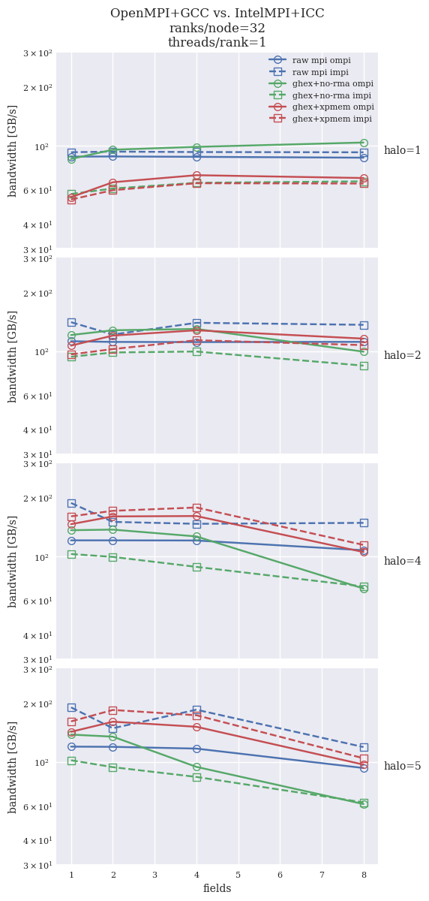

## `halfcores` single-node results

Comparison of results for 64^3 per-rank grids, `halfcores` (64 ranks per compute node, `hwcart` decomposition  
`--socket 1 1 2 --numa 1 2 2 --l3 2 2 1 --core 2 1 1`.

Tables present execution time [s] of 10000 exchange calls.

### Plots



### Chosen results

Chosen halo width and number of fileds: `halo (1,5) X fields (1,8)`, (`hXfY`).

Cartesian communicator numbering order: **XYZ**

```
ompi
                                      h1f1      h5f1      h1f8      h5f8 
                                     ______    ______    ______    ______

    benchmark_ghex_comm_mpi          1.5331    5.2716     10.13    98.578
    benchmark_ghex_comm_ucx           1.517    5.3212    10.001    96.462
    benchmark_ghex_comm_xpmem_mpi    2.4552    5.1894    15.133    59.959
    benchmark_ghex_comm_xpmem_ucx    2.3787    5.1484    15.193     60.61
    benchmark_mpi_comm               1.4763    6.1309    11.957    63.083

impi
                                      h1f1      h5f1      h1f8      h5f8 
                                     ______    ______    ______    ______

    benchmark_ghex_comm_mpi          1.9561    9.5071    16.072    115.86
    benchmark_ghex_comm_ucx          2.2907    7.1981    15.799    94.536
    benchmark_ghex_comm_xpmem_mpi    2.4069    4.3976    16.271    55.506
    benchmark_ghex_comm_xpmem_ucx    2.4463    4.5558    16.211    56.246
    benchmark_mpi_comm               1.4015    3.8625    11.222    49.293
```

Cartesian communicator numbering order: **ZYX**

```
ompi
                                      h1f1      h5f1      h1f8      h5f8 
                                     ______    ______    ______    ______

    benchmark_ghex_comm_mpi          1.4594     5.278     10.22    98.682
    benchmark_ghex_comm_ucx          1.6214    5.3684    10.059    97.127
    benchmark_ghex_comm_xpmem_mpi     2.419     5.087    15.367    58.717
    benchmark_ghex_comm_xpmem_ucx    2.4194    5.0158    15.294    58.881
    benchmark_mpi_comm               1.4823    6.8061    12.069    69.365

impi
                                      h1f1      h5f1      h1f8      h5f8 
                                     ______    ______    ______    ______

    benchmark_ghex_comm_mpi          1.9449    9.4687    16.252    115.59
    benchmark_ghex_comm_ucx          2.2867    7.3279    15.794    94.404
    benchmark_ghex_comm_xpmem_mpi    2.5469    4.3019    16.444    55.033
    benchmark_ghex_comm_xpmem_ucx    2.5601    4.4837    16.391    53.982
    benchmark_mpi_comm               1.3813    3.8829    11.322    52.954
```

### Full results

All halo widths and field numbers:  `halo (1,2,4,5) X fields (1,2,4,8)`.
Table rows are halo width. Table columns are number of fields. Table columns without a suffix
are results for the `ompi` toolchain.

Cartesian communicator numbering order: **XYZ**

```
benchmark_ghex_comm_mpi
           1         2         4         8       1 (impi)    2 (impi)    4 (impi)    8 (impi)
         ______    ______    ______    ______    ________    ________    ________    ________

    1    1.4594    2.7123     5.042     10.22     1.9449      3.9503       7.917      16.252 
    2    2.2972    4.2544    8.2552    21.885     3.0628       5.974      12.065      29.219 
    4    4.1459    8.2193    18.995    66.354     5.7837      13.672      29.511      82.149 
    5     5.278    10.934    31.569    98.682     9.4687      17.945       42.43      115.59 

benchmark_ghex_comm_ucx
           1         2         4         8       1 (impi)    2 (impi)    4 (impi)    8 (impi)
         ______    ______    ______    ______    ________    ________    ________    ________

    1    1.6214    2.8277    5.2091    10.059     2.2867      4.1868      8.1245      15.794 
    2    2.2671    4.2491    8.2915    21.015     2.8415      5.4721      10.939      25.679 
    4    4.2167    8.2483     18.09    67.615      5.584       11.42      25.541      64.796 
    5    5.3684     10.95    31.561    97.127     7.3279      16.264      34.153      94.404 

benchmark_ghex_comm_xpmem_mpi
           1         2         4         8       1 (impi)    2 (impi)    4 (impi)    8 (impi)
         ______    ______    ______    ______    ________    ________    ________    ________

    1     2.419    4.3668    7.6539    15.367     2.5469      4.6811      8.3935      16.444 
    2    2.5861    4.8721    8.5641    18.361     2.7836      5.2362      9.4522      19.803 
    4    3.8194    7.2749    13.528     41.88     3.4489      6.6615      12.731      40.275 
    5     5.087     9.132    19.176    58.717     4.3019      7.9205      16.752      55.033 

benchmark_ghex_comm_xpmem_ucx
           1         2         4         8       1 (impi)    2 (impi)    4 (impi)    8 (impi)
         ______    ______    ______    ______    ________    ________    ________    ________

    1    2.4194    4.1905    7.6265    15.294     2.5601      4.5872      8.2923      16.391 
    2    2.5641    4.5776    8.5026    18.475     2.7873       5.132      9.4692      19.688 
    4    3.8386    7.1215    13.578    41.956     3.5318      6.6775      12.838      38.889 
    5    5.0158    9.0417    19.061    58.881     4.4837      7.9633          17      53.982 

benchmark_mpi_comm
           1         2         4         8       1 (impi)    2 (impi)    4 (impi)    8 (impi)
         ______    ______    ______    ______    ________    ________    ________    ________

    1    1.4823      2.97    5.9675    12.069     1.3813      2.7834      5.6205      11.322 
    2    2.4599    4.9366     10.09    20.281     1.9257      3.8823      7.7322      15.901 
    4    5.2103    10.463    20.979    47.002     3.0439      7.5695       12.43      30.443 
    5    6.8061    13.704     27.57    69.365     3.8829      9.8964      15.835      52.954 
```

Cartesian communicator numbering order: **ZYX**
```
benchmark_ghex_comm_mpi
           1         2         4         8       1 (impi)    2 (impi)    4 (impi)    8 (impi)
         ______    ______    ______    ______    ________    ________    ________    ________

    1    1.5331    2.6973    5.1448     10.13     1.9561      4.1543      7.8852      16.072 
    2    2.2582    4.2051    8.2989    21.969     3.1485      5.9292      11.976      28.005 
    4    4.2074    8.1639    18.697    66.028     5.6786      13.395      29.936      81.211 
    5    5.2716     10.62    31.446    98.578     9.5071      17.588      42.349      115.86 

benchmark_ghex_comm_ucx
           1         2         4         8       1 (impi)    2 (impi)    4 (impi)    8 (impi)
         ______    ______    ______    ______    ________    ________    ________    ________

    1     1.517     2.722     5.264    10.001     2.2907      4.2979      8.0346      15.799 
    2    2.2166    4.1917    8.2557    21.576     2.8645      5.4435      10.769      25.425 
    4    4.1785    8.2998    17.986    66.433     5.5297      11.444      25.739      64.838 
    5    5.3212    10.905    31.125    96.462     7.1981      15.614      35.035      94.536 

benchmark_ghex_comm_xpmem_mpi
           1         2         4         8       1 (impi)    2 (impi)    4 (impi)    8 (impi)
         ______    ______    ______    ______    ________    ________    ________    ________

    1    2.4552    4.1226    7.3871    15.133     2.4069      4.4844      8.1605      16.271 
    2    2.8885     4.778    8.3851    18.843     2.8155      5.4013      9.3963      20.378 
    4    3.8942    7.2467    13.854    43.141     3.4799      6.7502      12.702      39.931 
    5    5.1894    9.2097    19.204    59.959     4.3976      8.0144      16.791      55.506 

benchmark_ghex_comm_xpmem_ucx
           1         2         4         8       1 (impi)    2 (impi)    4 (impi)    8 (impi)
         ______    ______    ______    ______    ________    ________    ________    ________

    1    2.3787    3.9916     7.347    15.193     2.4463      4.3831      8.0763      16.211 
    2    2.5109     4.463     8.386    18.501     2.7856      5.2313      9.4244      19.967 
    4    3.8917    7.1059    14.146    43.243     3.5495      6.6521      12.795      39.754 
    5    5.1484    9.1448    19.411     60.61     4.5558       7.963      16.951      56.246 

benchmark_mpi_comm
           1         2         4         8       1 (impi)    2 (impi)    4 (impi)    8 (impi)
         ______    ______    ______    ______    ________    ________    ________    ________

    1    1.4763    2.9468    5.9185    11.957     1.4015       2.783      5.5942      11.222 
    2    2.3846    4.8089    9.6341    19.219     1.9063      4.4073      7.6782      15.725 
    4    4.7087    9.4188    18.867    42.327     3.0324      7.5779      15.503      30.663 
    5    6.1309    12.291    25.098    63.083     3.8625      9.8757      15.879      49.293 
```