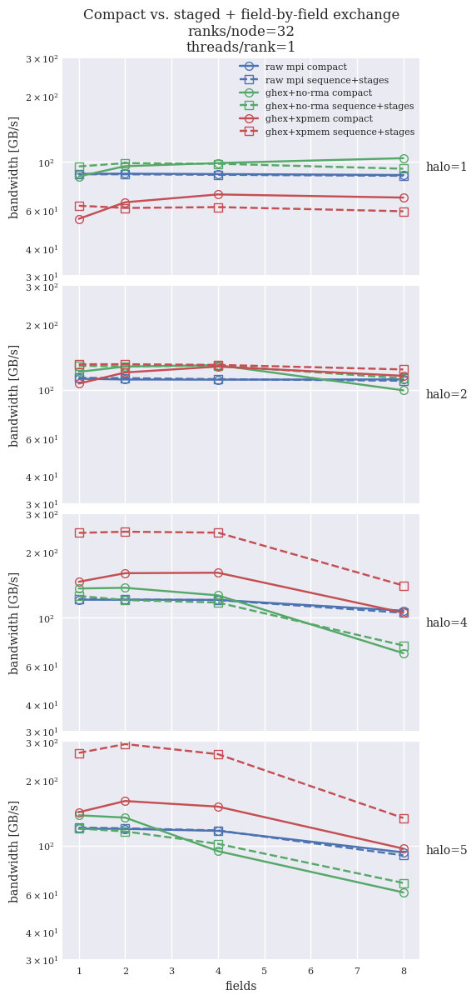

## `halfcores` results: compact vs. field-by-field algorithm

The following tables present execution times of the compact algorithm, in which halos for multiple fields
are packed into the same buffer, with the field-by-field algorithm, in which the halos are exchanged for
each individual field, in sequence. Two variants of the latter field-by-field approach are tested: staged and standard.

Comparison of results for 64^3 per-rank grids, `halfcores` (64 ranks per compute node, `hwcart` decomposition  
`--socket 1 1 2 --numa 1 2 2 --l3 2 2 1 --core 2 1 1`.

Tables present execution time [s] of 10000 exchange calls.

### Plots

