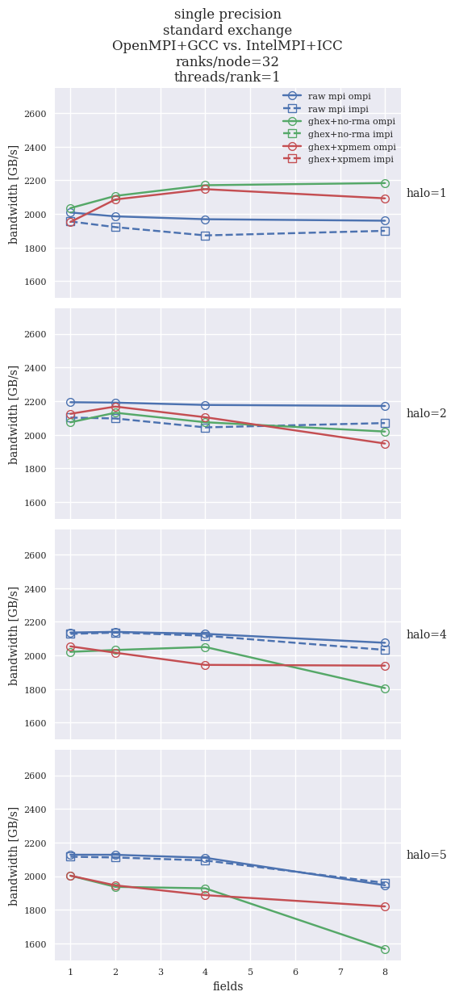
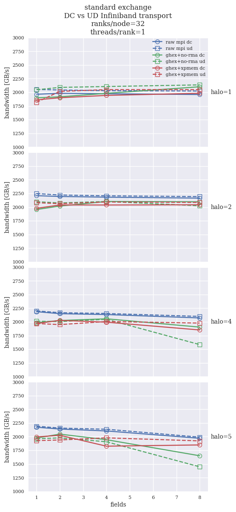
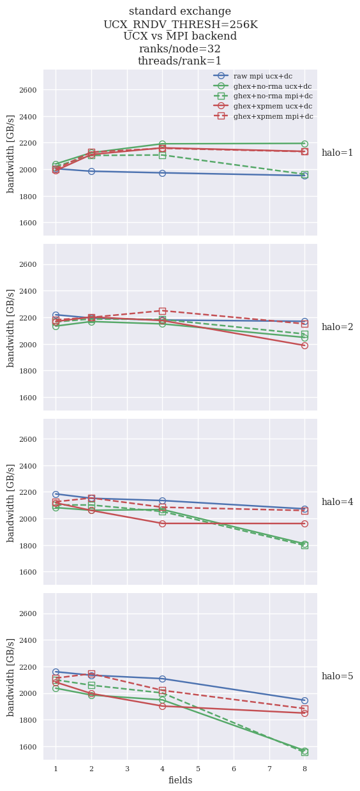
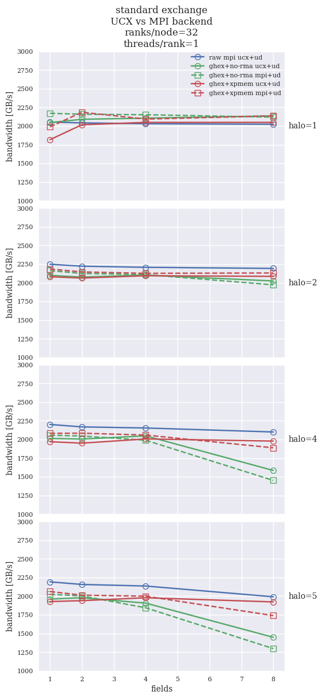
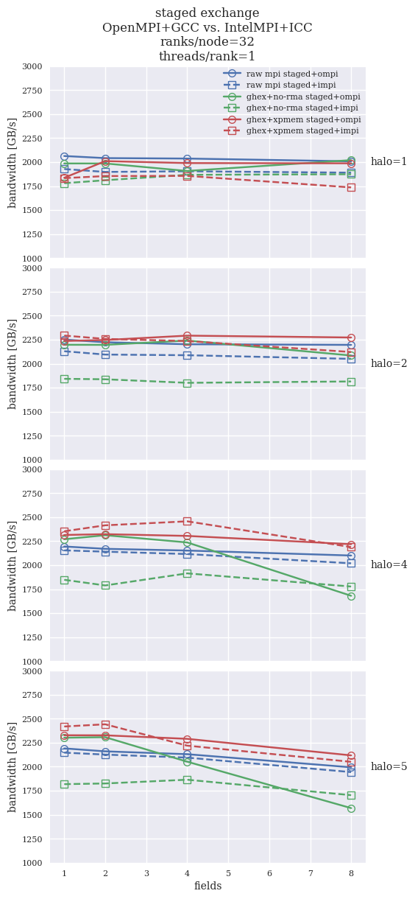
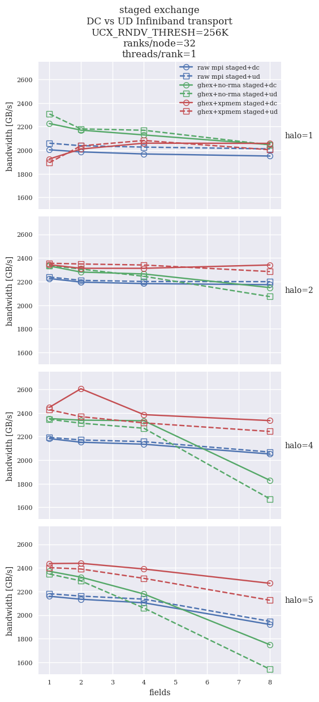
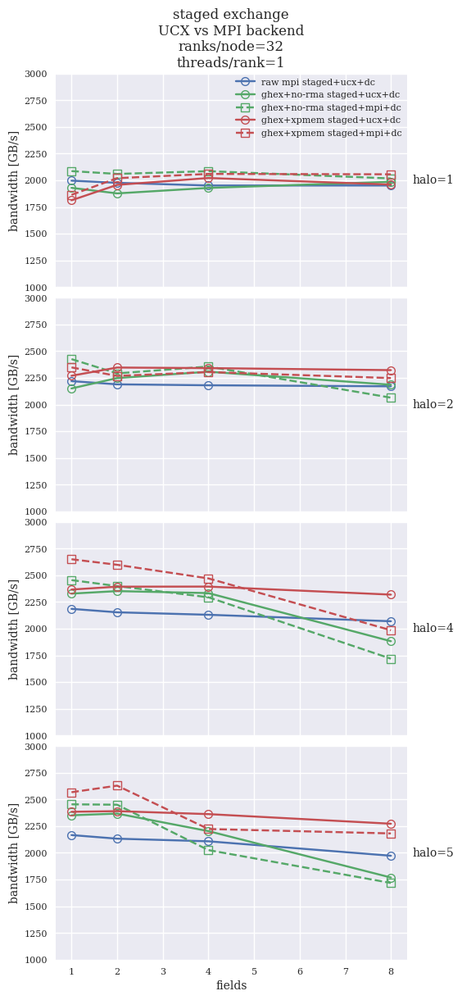
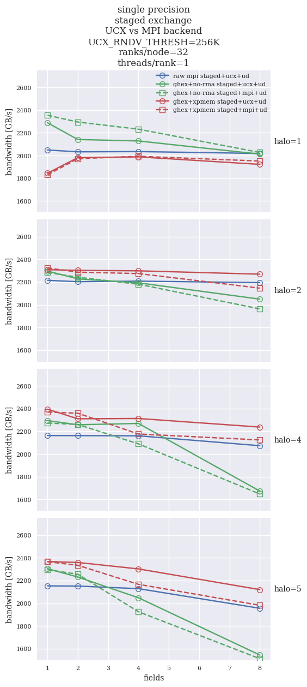
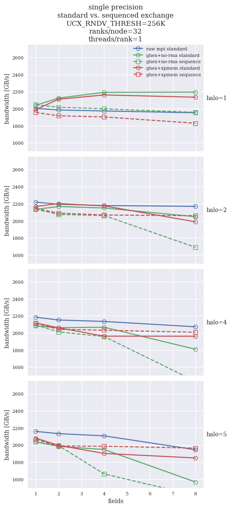
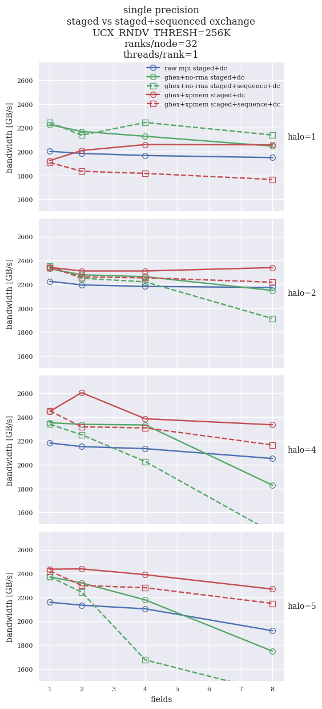

## Comparison of various 27-nodes results

All tests have been run with 64^3 per-rank grids, `halfcores` (64 ranks per compute node, `hwcart` decomposition  
`--node 3 3 3 --socket 1 1 2 --numa 1 2 2 --l3 2 2 1 --core 2 1 1`.

Plots present cumulative effective memory bandwidth of the exchange operation (more=better).

[Standard algorithm](#standard-algorithm)  
&nbsp; &nbsp;  [`impi` vs `ompi`](#impi-vs-ompi)  
&nbsp; &nbsp;  [UCX vs MPI](#ucx-vs-mpi)  
[Staged algorithm](#staged-algorithm)  
&nbsp; &nbsp;  [`impi` vs `ompi`](#impi-vs-ompi-1)  
&nbsp; &nbsp;  [UCX vs MPI](#ucx-vs-mpi-1)  
[Sequenced algorithm](#sequenced-algorithm)  

### Standard algorithm

Standard algorithm means that each rank performs explicit halo exchanges with each of the 26 neigobors. For
multiple fields the data is packed into a single array and sent in one large message.

The standard algorithm is implemented in all the `ghex` variants of the benchmark. 
The raw MPI version of the benchmark implements the [staged algorithm of the 3D halo exchange](#staged-algorithm).

#### `impi` vs `ompi`

Only `benchmark_mpi_comm` was executed with the Intel compiler. The problem is that
the `ghex_comm` variants take much too long time to initialize. From the comparison it
seems that Intel MPI is considerably worse for small halos, and starts to perform similar
starting from halo ~4.

#### Infiniband transport (DC vs UD)

Infiniband traffic can be sent using UD (unreliable datagram) and DC (connected) transports. Sometimes the performance
differs signifficantly. In the plots below we see that the raw MPI implementation performs similar. For the standard algorithm,
`ghex_comm+ucx` prefers the UD transport for small halos. In this case all variants give a simiar performance, comparable
to raw MPI implementation.

For larger halos the performance differs for `no-rma` and `xpmem`: the `no-rma` variant prefers DC, while the `xpmem` seems
to slightly favor the UD transport. Overall, UD will probably have lower performance for large number of messages (more
can get lost and need retransmission?).

#### UCX vs MPI

Here we compare the two supported backends - UCX and MPI - with both DC (left) and UD (right) transports.
We can again see that the UD transport affects the performance of both `ghex+no-rma` variants, and that DC is clearly
better in this case.

UCX yields better performance for most `no-rma` variants, but seems to be worse for the `xpmem` variant. 
The reasons are not understood.

In most cases the raw MPI implementation is better than any of the `ghex` variants. Interestingly, the MPI backend
does well for halo 1. This is NOT the case for the UCX backend, which is also not understood.

UCX vs MPI, DC transport             |  UCX vs MPI, UD transport
:-------------------------:|:-------------------------:
  |  

### Staged algorithm

The staged algorithm of the 3D halo exchange performs 3 ordered one-dimensional halo exchanges one after another.
The subsequent steps also distribute the data received in previus steps, hence the algorithm is equivalent to a full 
halo exchange with 26 neighbors. However, it performs the exchange in 6 messages rather than 26, which as will be demonstrated
has a signifficant impact on performance.

#### `impi` vs `ompi`

Here all the benchmarks are compared for both compilers, as in the case of the staged algorithm the overhead
of the initialization phase has been eliminated.

For small halos, the raw MPI version performs better with `ompi`. For halo size 4+ performance is more similar,
with `ompi` still having a small advantage`.

In general, for all `ghex` variants performance is better with `ompi` than `impi`. However, it should be noted that
the `no-rma` variant seems to scale differently with `impi`: for halo 4 and 5 the performance curve is roughly flat, 
while for `ompi` the performance starts high, and then falls for 4 and 8 fields.

#### Infiniband transport (DC vs UD)

The below plot shows performance of `ghex+ucx` variants with different IB transport. 
For halo 1 all codes yield roughly similar performance as the raw MPI implementation, except for maybe 1 field.
The `no-rma` variant is slightly worse for small problems.

For halos larger than 1 we see a clear advantage of the `xpmem` variant with the DC transport. It outperforms the raw
MPI version for all number of fields. 

#### UCX vs MPI

Here we compare the two supported backends - UCX and MPI - with both DC (left) and UD (right) transports.
We can again see that the UD transport affects the performance of both `ghex+no-rma` variants, and that DC is clearly
better in this case.

As with the standard algorithm, UCX yields better performance for most `no-rma` variants. 
The situation is more complex for the `xpmem` variant. While UCX is better in the UD case, there
seems to be a cross-over in the DC case and halo 4 and 5: for small number of fields the MPI version is better.
For large number of fields the UCX takes over and is sometimes much better (halo 4). Again, this is not understood and 
needs clarification. Maybe UCX performance can be improved.

In the staged method, in most cases the raw MPI implementation is worse than `ghex+xpmem` variants. For small number of fields
the `no-rma` variants are also better, but then the performance drops. This is maybe connected with the packing/unpacking
to a single buffer. As in the standard case, the MPI backend does well for halo 1. This is NOT the case for the UCX backend, 
which is also not understood. There should not be a qualitative difference between those two backends.

UCX vs MPI, DC transport             |  UCX vs MPI, UD transport
:-------------------------:|:-------------------------:
  |  

### Sequenced algorithm

The sequenced algorithm performs halo exchange for each field individually, rather than packing all data for all
fields into a single buffer.

In general, the sequenced algorithm performs not much different than the standard algorithm. Some negative effect
is seen for the `xpmem` variant for halo 1.

#### Staged vs. sequenced+staged

A clean staged alorithm is clearly a better than steged and sequenced algoritm: field-by-field exchange slightly
decreases the performance. \

