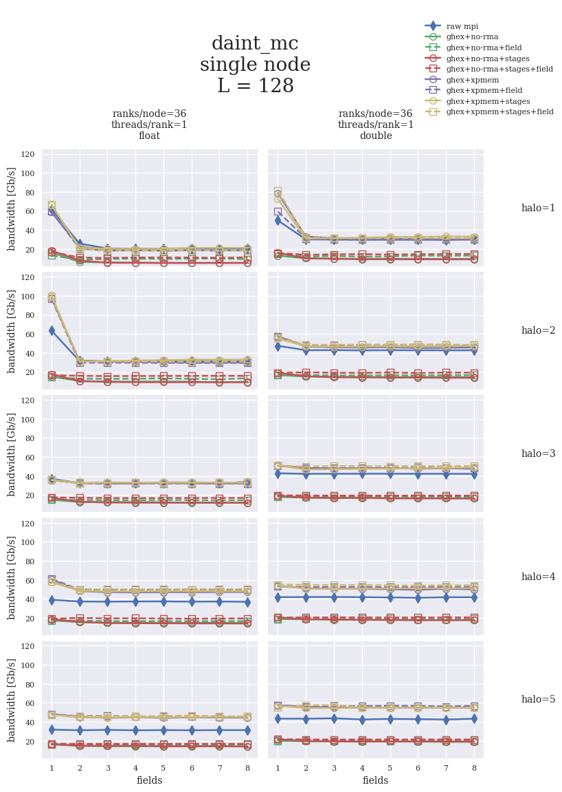
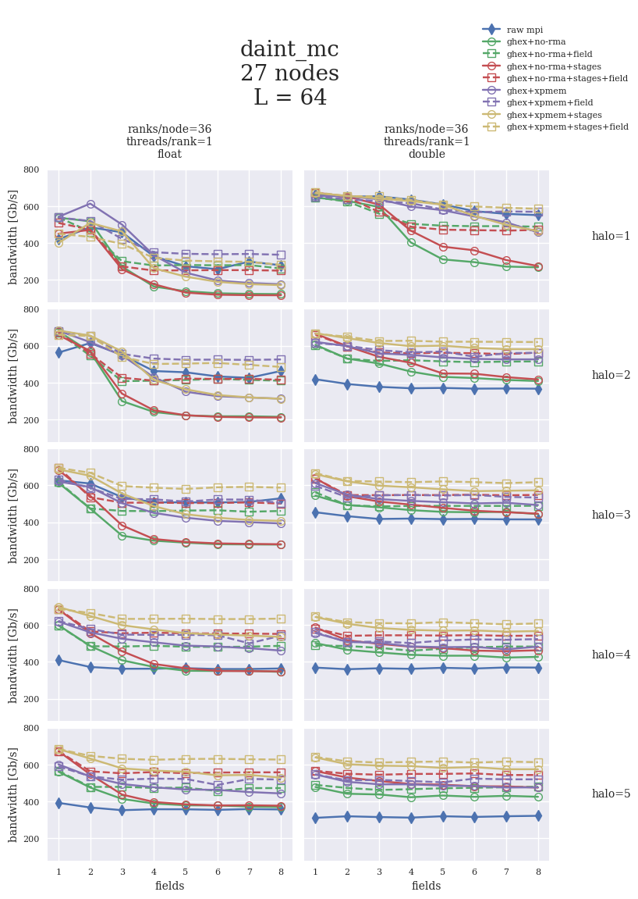
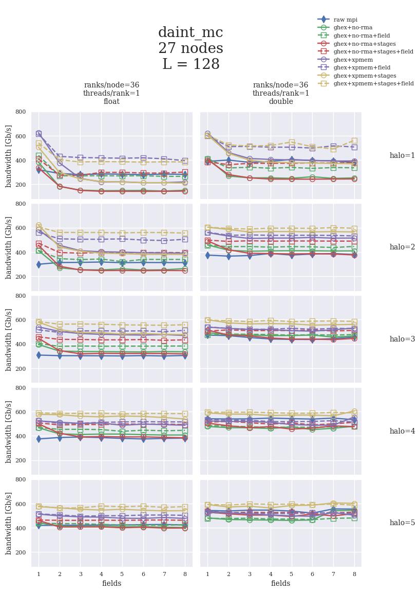
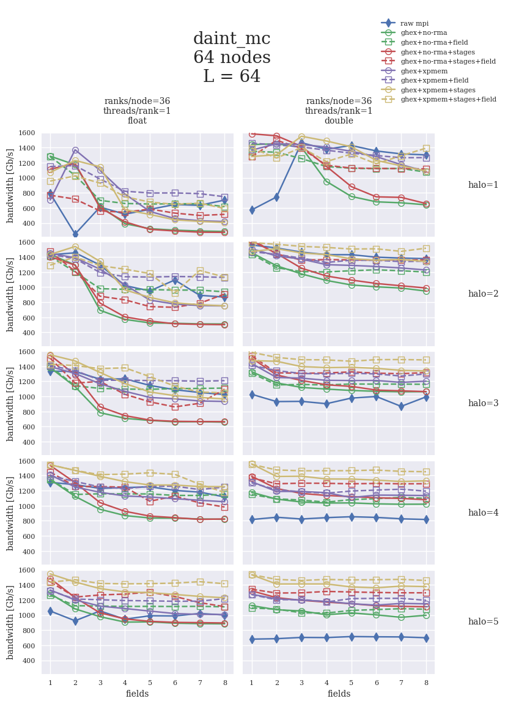
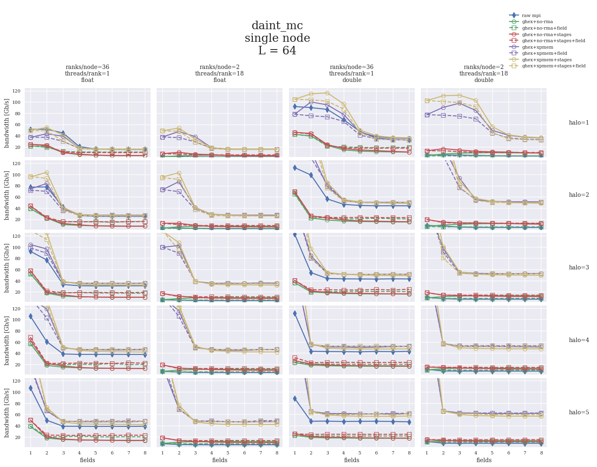
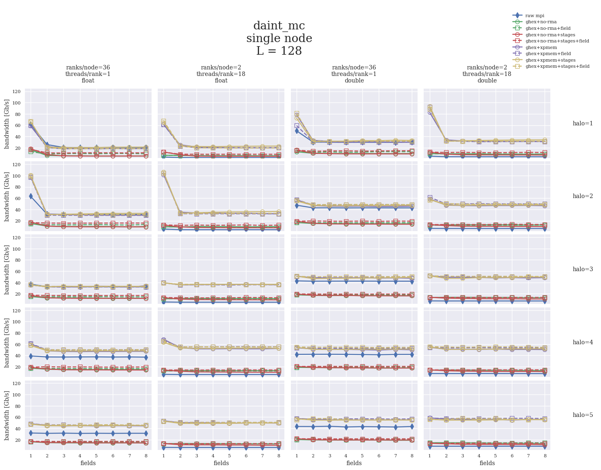
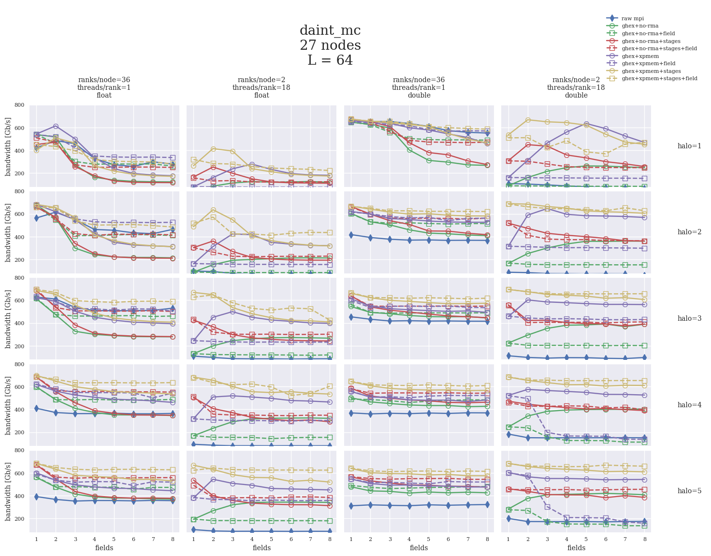
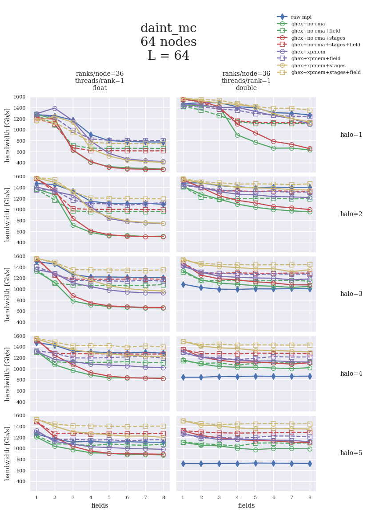

# Results on Daint MC

|Memory   |#C/T     |CPU VERSION                        | #ACCEL  |ACCEL TYPE|
|--------:|--------:|:----------------------------------|:--------|:---------|
|2x 64 GB |2x 18/36 |2x Intel Xeon E5-2695 v4 @ 2.10GHz |NO       |          |

## hwloc info

    depth 0:	1 Machine (type #1)
     depth 1:	2 NUMANode (type #2)
      depth 2:	2 Package (type #3)
       depth 3:	2 L3Cache (type #4)
        depth 4:	36 L2Cache (type #4)
         depth 5:	36 L1dCache (type #4)
          depth 6:	36 L1iCache (type #4)
           depth 7:	36 Core (type #5)
            depth 8:	72 PU (type #6)

<!--
 

 

 
-->

L=64 | L=128
:---:|:----:
 | 
[single](daint_mc_0001_064_float.md), [double](daint_mc_0001_064_double.md) | [single](daint_mc_0001_128_float.md), [double](daint_mc_0001_128_double.md)
 | 
[single](daint_mc_0027_064_float.md), [double](daint_mc_0027_064_double.md) | [single](daint_mc_0027_128_float.md), [double](daint_mc_0027_128_double.md)
 | 
[single](daint_mc_0064_064_float.md), [double](daint_mc_0064_064_double.md) | [single](daint_mc_0064_128_float.md), [double](daint_mc_0064_128_double.md)

